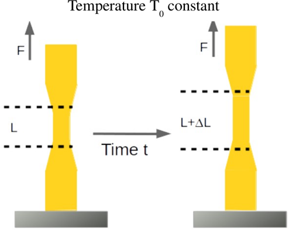

### Introduction

Many engineering components operate under loads that remain constant for long periods. Although these loads may be well below the ultimate strength of the material, some materials continue to deform gradually with time. This phenomenon is known as **creep**.

Creep is the **time-dependent permanent deformation of a material under a constant load or constant stress**. It becomes particularly important for components operating at elevated temperatures, such as steam pipes, turbines, boilers, nuclear reactors, and jet engines. However, materials with low melting temperatures, such as lead, exhibit measurable creep even at room temperature.

In this experiment, a lead specimen is subjected to a constant load, and its extension is measured at regular intervals to study its creep behaviour.

### Physical Concept

When a constant load is applied to a material, an immediate elastic deformation occurs. If the load continues to act over time, the material may continue to deform gradually even though the applied load remains unchanged.

This gradual increase in deformation is called **creep**.

For many engineering materials, creep becomes significant only at high temperatures. However, lead has a relatively low melting point, making it suitable for demonstrating creep under laboratory conditions at room temperature.

<b>Figure 1. Creep testing apparatus showing a lead specimen subjected to a constant load.</b>

### Everyday Intuition

Examples of creep can be observed in daily life:

- Electrical wires sag gradually over many years.
- Plastic shelves bend permanently when overloaded.
- Asphalt roads deform under continuous traffic loading during hot weather.
- Lead seals slowly deform under sustained pressure.

These examples demonstrate that materials may continue to deform even when the applied load remains constant.

### Experimental Relevance

The creep test helps determine how a material behaves under prolonged loading.

The experiment allows the determination of:

- Time-dependent deformation
- Extension of the specimen
- Rate of creep
- Long-term dimensional stability

The results help engineers predict the service life of structural and mechanical components subjected to sustained loads.

### Stages of Creep

A typical creep curve consists of three stages.

#### Primary Creep

- Rapid deformation immediately after loading.
- The creep rate gradually decreases due to work hardening.

#### Secondary Creep

- The creep rate becomes nearly constant.
- This is the longest stage and is often used for engineering design.

#### Tertiary Creep

- The creep rate increases rapidly.
- Internal damage accumulates.
- The material eventually fractures.

### Mathematical Formulation

Engineering strain is given by

$$
\varepsilon=\frac{\Delta L}{L}
$$

where

- $\varepsilon$ = Engineering strain
- $\Delta L$ = Extension of the specimen
- $L$ = Original gauge length

The creep rate is the rate of change of strain with time,

$$
\dot{\varepsilon}=\frac{d\varepsilon}{dt}
$$

where

- $\dot{\varepsilon}$ = Creep rate
- $t$ = Time

The extension of the specimen is recorded at regular time intervals to study the variation of strain with time.

### Effect of Temperature

Creep strongly depends on temperature.

For most metals,

$$
T>0.4T_m
$$

where

- $T$ = Operating temperature (absolute scale)
- $T_m$ = Melting temperature of the material

Above this temperature, creep becomes significant.

Since lead has a melting temperature of approximately

$$
327^\circ\mathrm{C}
$$

it exhibits measurable creep even at room temperature.

### Apparatus and Working Principle

The creep testing apparatus consists of:

- Rigid loading frame
- Lead specimen
- Constant loading arrangement
- Dial gauge or displacement indicator
- Time measuring device

A constant load is applied to the specimen.

The extension is measured at regular time intervals while maintaining the same load throughout the experiment.

The measured values are used to study the creep behaviour of the material.

### Engineering Significance

Creep analysis is important in the design of engineering components that operate under sustained loads for long durations.

Examples include:

- Steam pipes
- Pressure vessels
- Turbine blades
- Boilers
- Nuclear reactors
- Bridges
- High-temperature industrial equipment

Understanding creep helps engineers estimate long-term deformation, prevent excessive deflection, and improve the reliability and safety of structures.
